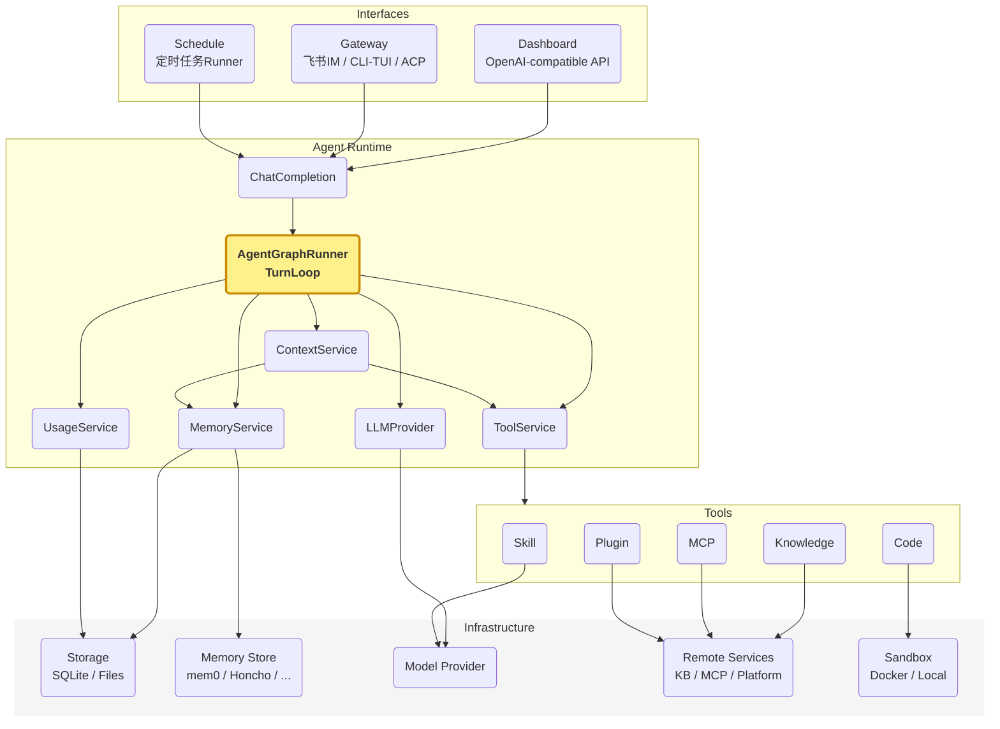
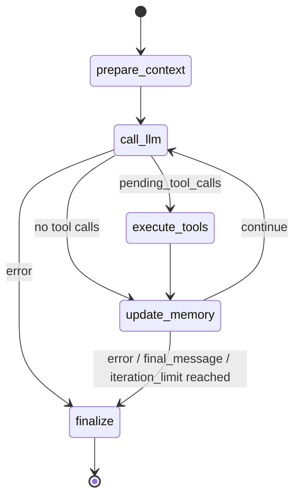
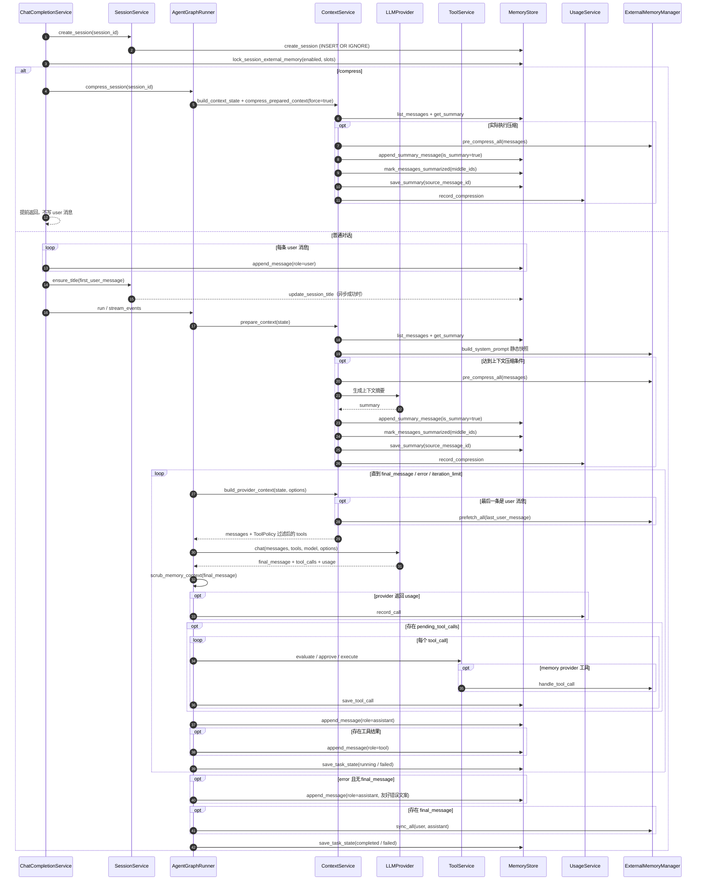
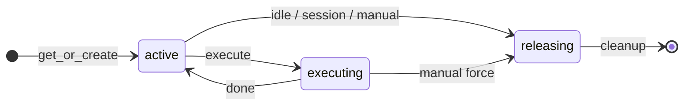
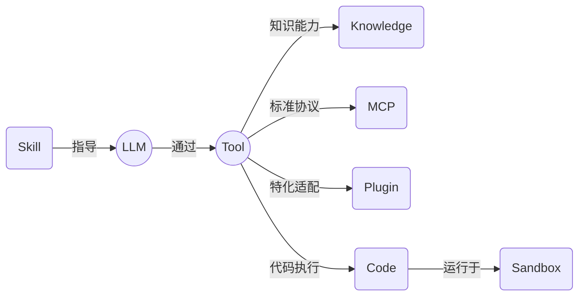

本文介绍自研Agent套装[N-Agent](https://github.com/niean/n-agent)，一款类似Hermes的Agent Runtime。
核心流程：接收对话请求，加载会话上下文，循环"调用模型→按需执行工具"直至产出最终回答，更新会话与外部记忆，返回同步或流式结果。


## 领域划分

```text
Agent Runtime
├── 核心子域
│   ├── TurnLoop：单轮对话执行编排，包括上下文准备、LLM交互、工具执行、记忆更新、结束判断
│   ├── Context：组装模型输入视图，包括基础消息上下文、约束过滤后的工具定义等
│   ├── LLM：模型交互子域，负责Provider Request(请求)构造、模型调用、响应解析
│   ├── Memory：记忆管理，包括会话记忆、跨会话的外部记忆
│   └── Tool：工具契约与执行编排，把模型 tool_calls 转换为受控的工具执行
├── 支撑子域
│   ├── Knowledge：KB的SPI定义、实例管理，通过search_knowledge检索知识
│   ├── MCP：MCP site 注册与工具同步，把远程 MCP server 工具暴露给 LLM 调用
│   ├── Plugin：本地插件包扫描、启停、配置和工具动态注入
│   ├── Skill：本地SKILL.md包管理，通过skills_list/skill_view暴露给 LLM 自助使用
│   ├── Sandbox：受控代码执行子域execute_code(Python)、terminal(Shell)
│   ├── Schedule：定时任务定义、调度、租约执行与结果投递
│   ├── Gateway：统一飞书、CLI/TUI、ACP 的交互消息、入口会话、命令与确认，并路由至ChatCompletionService
│   ├── Platform：飞书等外部消息平台抽象，生命周期管理
│   └── Usage/Observation：模型用量、成本、上下文构成与压缩收益观测
├── Shared Kernel
│   └── Policy：通用决策契约
└── 外部边界
    ├── Storage
    └── Model Provider
```

系统核心模块，如下：




## TurnLoop
Agent会话之单轮对话，是Agent的核心业务流程，FSM状态图如下：



单轮对话 SD时序图如下：`ChatCompletionService.complete` → `AgentGraphRunner`（LangGraph.Graph.StateGraph）




## Context

Context 子域负责模型调用前的运行视图组装。prepare_context 准备基础消息上下文，包括 system prompt、历史消息/摘要(动态压缩)、本轮用户输入；每次 call_llm 前，再由 build_provider_context 生成本次 Provider Context。

```text
Context Frame
├─ 1. System Prompt
│  ├─ 身份 identity / 指令 instruction / 安全约束 safety
│  ├─ 技能 skills index
│  └─ 外部记忆-静态快照：已启用 provider 的 system_prompt_block
│
├─ 2. Session Context
│  └─ ConversationMessage：head + latest summary + tail
│     └─ compression：历史消息滚动压缩，最新摘要latest summary
│
├─ 3. Turn Context
│  ├─ 本轮 input messages
│  └─ 外部记忆-动态检索：call_llm 前 prepend 到 本轮用户输入user message
│
├─ 4. Tool Context
│  └── tool schemas：工具描述，经工具策略 ToolPolicy 过滤
│
└─ 5. Execution Context
   ├─ run options
   │  ├─ external_memory_enabled：选择外部记忆来源
   │  └─ tool_exposure_policy：选择可见 tool definitions
   └─ ToolExecutionContext：工具授权、trusted_metadata、execution_context_mode

       │ ContextService 组装
       ▼

ProviderContext
├─ messages ← 1 + 2 + 3
└─ tools    ← 4

AgentGraphRunner 再组合 ProviderContext + model + options，调用 llm_provider.chat(...)
```


<details markdown="1">
<summary>对话示例</summary>

```text
前提
├─ input_messages: [user("我叫什么，最喜欢什么水果？顺便打印下 UTC 时间。")]
├─ external_memory_enabled: ["file_memory_1", "mem0"]
├─ file_memory_1 静态快照: "所有回复以‘外部记忆1：’开头。"
├─ mem0 已存事实:
│  ├─ "用户名是 niean"
│  ├─ "最喜欢的水果是西瓜"
│  └─ "偏好简洁回复"
└─ tools: [get_current_time, ...]

prepare_context
└─ working_messages
   ├─ system(identity / instruction / safety / skills index /
   │        file_memory_1 静态快照 / mem0 system_prompt_block())
   └─ user("我叫什么，最喜欢什么水果？顺便打印下 UTC 时间。")

call_llm #1
├─ 外部记忆-动态检索：prefetch_all()，返回:
│  └─ <memory-context>
│     └─ <provider name="mem0">
│        └─ ## Mem0 Memory
│           ├─ 用户名是 niean
│           ├─ 最喜欢的水果是西瓜
│           └─ 偏好简洁回复
├─ 将 <memory-context> 临时 prepend 到最后一条 user message
├─ ProviderContext.messages: [system, user(memory-context + input message)]
├─ ProviderContext.tools: [get_current_time, ...]
├─ llm_provider.chat(...)
└─ LLM 返回 tool_calls: [get_current_time]

execute_tools
└─ ToolCall: 保存 get_current_time 执行审计

update_memory #1
└─ ConversationMessage:
   ├─ assistant(tool_calls)
   └─ tool(result)

call_llm #2
├─ working_messages: [system, user, assistant(tool_calls), tool(result)]
├─ llm_provider.chat(...)
└─ LLM 返回 final_message:
   └─ assistant("外部记忆1：你叫 niean，最喜欢西瓜。当前 UTC 时间是……")

update_memory #2
├─ ConversationMessage: 追加 assistant(final_message)
└─ TaskState: 保存 running 状态

finalize
├─ ExternalMemoryManager.sync_all(...):
│  └─ agent_context="primary" 时，mem0.sync_turn() 同步本轮 user/assistant 消息
└─ TaskState: 保存 completed 状态
```
</details>


## LLM

LLM 子域对应 `call_llm` 节点，负责一次模型交互，不负责工具执行或记忆写入。

```text
LLM
│
├── Provider Request
│     ├── provider context：messages / tools (由 Context 子域组装)
│     ├── model
│     └── options
│
├── Provider Call
│     └── llm_provider.chat(...)
│
└── Response Parse
      ├── final_message
      ├── pending_tool_calls
      ├── finish_reason
      ├── usage
      └── next_step
```


## Memory

Memory 有两条持久化边界：会话记忆保存当前 session 的运行事实，外部记忆保存跨 session 知识。

```text
Memory
├─ 会话记忆: MemoryStore → SQLiteMemoryStore
│  ├─ ConversationSession: source / title / external_memory_enabled / slots / ACP metadata
│  ├─ ConversationMessage: user / assistant / tool / is_summary / is_summarized
│  └─ ToolCall / TaskState / Summary
└─ 外部记忆: ExternalMemoryProvider → ExternalMemoryManager → Provider Adapter
   ├─ builtin: Markdown + trust metadata + observations
   ├─ multi-project: 多目录 Markdown
   └─ external-query: mem0 / holographic / honcho，全局至多一个 active
```

| 槽位 | 实现 | 存储与写入 |
|------|------|-----------|
| builtin | `BuiltinProjectMemory` | `{memory,user,observations}.md` + `memory.meta.json`；`sync_turn` 追加观察 |
| multi-project | `MultiProjectMemory` | 每个项目一组 `{memory,user}.md`；`sync_turn` 为 no-op，只由工具写入 |
| external-query | `Mem0Adapter` | HTTP 事实库 |
| external-query | `HolographicAdapter` | 本地 SQLite；`MemoryRetriever` 使用 Jaccard + 词频检索 |
| external-query | `HonchoAdapter` | HTTP workspace / peer / session context |


## Tool

Tool 子域定义 Agent 可发现、可调用的能力契约，并把 LLM tool_calls 转换为受控执行。它不实现 Knowledge、MCP、Plugin、Skill、Sandbox 等具体能力。

```text
Tool
├─ Application：ToolService 管理工具定义、模型暴露、执行编排
├─ Domain
│   ├── ToolDefinition：工具定义，主要是能力描述，不包含 handler
│   ├── ToolCallRequest：调用请求，包含 id、name、arguments
│   ├── ToolPolicy：执行管控，治理工具的校验、暴露、执行、审批要求
│   ├── ToolExecutionContext：执行上下文，携带授权和可信运行信息，仅限单轮对话
│   ├── ToolExecutor：执行接口，定义SPI，具体实现属于各支撑子域或 Infrastructure
│   └── ToolResult：执行结果，包含状态、内容和耗时
└─ Infrastructure：CompositeToolExecutor 按工具名路由到具体 ToolExecutor
```

一个工具可用需同时具备定义和执行路由：前者决定模型能否看到，后者决定调用能否落到具体实现。ToolService 是不可绕过的执行边界，执行前会按当前定义复判。

```text
ContextService 通过 ToolService 生成可见 tool definitions
  -> LLM 返回 tool_calls
  -> TurnLoop 构造 ToolCallRequest
  -> TurnLoop 拿到执行授权(如需)，过程是：ToolService 查找 ToolDefinition，调用 ToolPolicy、生成 PolicyDecision，TurnLoop根据 PolicyDecision 发起审批、获得执行授权
  -> ToolService 执行前复判 ToolPolicy
  -> ToolExecutor 执行具体能力
  -> ToolResult 作为 role=tool 消息回流 LLM
```


## Sandbox

Sandbox 子域为模型提供受控执行环境，承载 `execute_code`（Python）与 `terminal`（Shell）。两者均为 `RiskLevel.SAFE`工具，Docker 是生产安全边界、不走审批。

所有入口统一经过 ToolService，并按工具路由到独立 Executor：

```text
Interface/Gateway -> ChatCompletionService -> AgentGraphRunner.execute_tools
  -> ToolService.execute
       ├─ execute_code -> SandboxToolExecutor
       │    └─ 会话锁 -> get_or_create -> per-call staging -> Sandbox.execute
       └─ terminal -> TerminalToolExecutor
            └─ 会话锁 -> get_or_create -> 校验 workdir -> Sandbox.exec_command
  -> SandboxExecutionHistoryRegistry
  -> ToolResult 回流 AgentGraph，写 role=tool 消息
```

<details markdown="1">
<summary>生命周期</summary>

`SandboxManager` 按 session 懒创建并串行执行。空闲到期或 session 删除时协作释放；Dashboard 可强制释放。Docker 启动时还会清理上次进程遗留的孤儿容器。


</details>


<details markdown="1">
<summary>安全边界</summary>

- Docker：workspace 只读、scratch 可写，默认禁网，并限制 CPU、内存、进程与临时目录。
- `execute_code`：外部能力仅能通过 UDS RPC callback tools 获取，并受 allowlist、调用次数与超时约束。
- `terminal`：不使用 callback tools；workdir 仅允许 scratch/workspace，workspace 仍只读。非零退出码表示命令执行失败，但工具状态仍为 SUCCESS；仅超时或执行异常映射为 TIMEOUT/ERROR。
- 审计：两类执行都持久化 code_hash、状态、结果和 `execution_type`；Sandbox 异常转为 `ToolResult(ERROR)`，不打断 AgentGraph。
</details>


## XUI

N-Agent 用户入口类型，有如下几类：

| 入口  | 传输+编码协议 | 适配器 | 应用层 | 适配器源文件 |
|:-----|:------------|:------|:------|:-----------|
| Dashboard 管理 API | HTTP+JSON | create_*\_router / register_*\_routes | 不进入 Agent Runtime | app/interfaces/http/ |
| OpenAI 兼容对话 API | HTTP/SSE+JSON | create_openai_compatible_router | ChatCompletionService | app/interfaces/http/openai_compatible.py |
| 飞书 IM 长连接 | WebSocket+JSON | FeishuImAdapter | GatewayService → ChatCompletionService | app/interfaces/feishu_im_adapter.py |
| TUI/CLI Chat | Stdio+行式文本 | CliChatAdapter | GatewayService → ChatCompletionService | app/interfaces/cli/ |
| ACP Agent | Stdio+JSON | NAgentACPAgent | GatewayService → ChatCompletionService | app/interfaces/cli/commands/acp/ |
| 定时任务执行 | - | SchedulerRunner | ScheduleRunService → ChatCompletionService | app/application/scheduler_runner.py |

其中，

- 管理API不进入 ChatCompletionService/Agent Loop；
- OpenAI 兼容对话 API 直接进入 ChatCompletionService；
- 飞书 IM、TUI/CLI、ACP 的用户消息先经 GatewayService 统一做入口会话、消息管理，再进入 ChatCompletionService。
- ACP协议生命周期保留在 NAgentACPAgent 中。
- 定时任务执行由 SchedulerRunner 定时触发，并通过 ScheduleRunService->ScheduledAgentExecutor 直接调用 ChatCompletionService，执行结果再由 ScheduleOutboundDelivery 投递。


---
---
以下是一些概念澄清、技术要点。

## 工具概念
- Skill：结构化Prompt，指导LLM怎么想、怎么说，进而完成功能。Skill定义**业务逻辑**，主决策而非执行，这是和其它工具的区别
- Plugin：特化工具为LLM定制的点对点适配，将外部工具能力、封装为LLM可调用函数FC/Tool；Plugin是本地部署的工具适配层，而非工具本身
- MCP：面向LLM的标准协议，用于统一外部工具、资源、上下文的访问方式，类似总线协议。站在LLM领域看，**MCP是SPI、Plugin是Adapter**




## 消息压缩

消息压缩属于 Context 子域，用于在模型上下文过长时保留开头和最近消息，并把中间可压缩消息滚动归并为摘要。默认形态：`head 3 + latest summary + tail 10`，`latest summary = llm_summary(last summary + middle)`。

```text
ConversationMessage + Summary
  -> ContextService.prepare_context 读取会话消息和 latest summary
  -> ContextPolicy 判断是否需要压缩，生成 CompressionPlan(head_n / tail_n / target_ratio)
  -> ExternalMemoryManager.pre_compress_all 抢救待压缩消息中的外部记忆线索
  -> ContextCompressor 按 head + middle + tail 切分；middle 与上次摘要一起生成新 summary
  -> 结果写成 head + latest summary + tail，避免把摘要追加到末尾
  -> MemoryStore 依次 append_summary_message -> mark_messages_summarized -> save_summary
  -> UsageService 记录压缩前后 token 与摘要观测
```


## Skill自进化

Skill 自进化是 Agent Runtime 对会话摘要的后台审查，把可复用、非平凡工作流沉淀为受治理的技能。每隔N轮对话触发1次自进化审查。

```text
会话摘要 digest
  -> SkillEvolutionService 按 nudge_interval 后台触发 maybe_trigger(session_id, turn_count, digest)
  -> 以 SkillWriteOrigin.BACKGROUND_REVIEW fork 审查 Agent，仅暴露 skills_list / skill_view / skill_manage
  -> 审查摘要是否值得持久化；修改已有 Skill 前必须 skill_view 读取目标
  -> SkillService.manage_skill 统一写入口和规范；SkillPolicy 判定 allow / require_approval / deny
  -> 通过 SkillFileLoader 写入 SKILL.md，并由 SkillRegistry / SkillUsageRegistry 记录可见性与使用事实
  -> 下轮 Context 的 System Prompt 注入 skills index；LLM 再通过 skills_list / skill_view 加载具体 Skill
```


